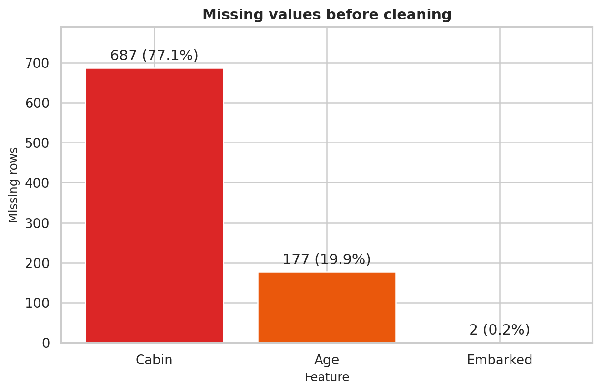
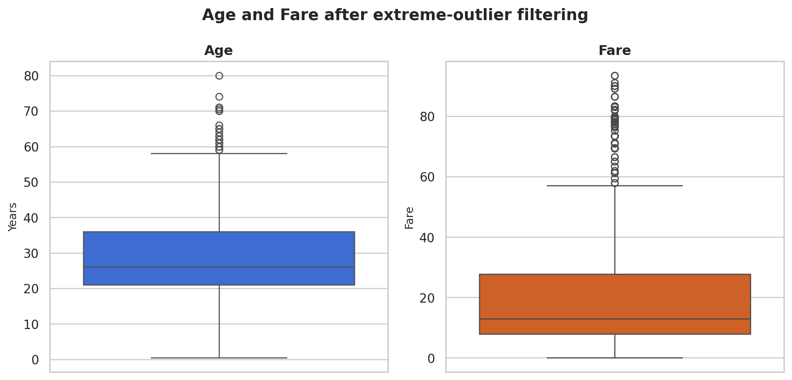
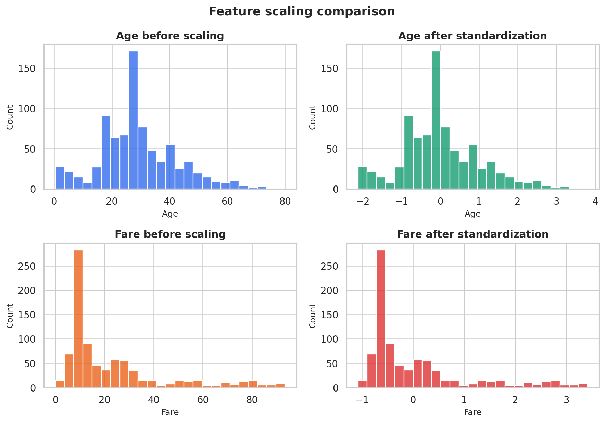

# Titanic Data Cleaning and Preprocessing

**Author:** Yuktha Ratna Puvvadi

## Objective

Clean the raw Titanic passenger dataset and turn it into a complete numerical
table that is ready for machine-learning work.

## What this project does

1. Loads the 891-row Titanic dataset and checks shape, data types, duplicates,
   unique values, and missing values.
2. Removes duplicate rows. None were found in this dataset.
3. Extracts passenger titles and creates useful features such as family size,
   travelling alone, deck, known-cabin status, ticket-group size, and fare per
   person.
4. Fills 177 missing ages with the median for the passenger's Sex, Pclass, and
   Title group. It uses the overall median only as a fallback.
5. Fills the 2 missing Embarked values with the mode, `S`.
6. Converts the heavily missing Cabin field into `Deck` and `CabinKnown`.
7. Uses boxplots and IQR bounds to detect outliers. The standard 1.5x rule is
   reported, but only extreme 3.0x IQR outliers are removed.
8. One-hot encodes Pclass, Sex, Embarked, Title, and Deck.
9. Standardizes Age, Fare, family counts, and ticket counts with
   `StandardScaler`.
10. Saves cleaned data, fully preprocessed data, quality reports, scaler
    parameters, removed rows, and five figures.

## Main result

| Check | Result |
|---|---:|
| Starting rows | 891 |
| Duplicate rows | 0 |
| Missing Age values filled | 177 |
| Missing Embarked values filled | 2 |
| Extreme outlier rows removed | 53 |
| Final rows | 838 |
| Missing values in final table | 0 |
| Survival rate after chosen filter | 36.16% |

The usual 1.5x IQR rule would remove 134 rows and reduce the observed survival
rate from 38.4% to 34.3%. That would discard many genuine high-fare passengers.
The script therefore records the 1.5x result but uses a more conservative 3.0x
rule for removal. The chosen rule removes 53 extreme-fare rows and no Age rows.

## Selected visuals







## Run the project

```bash
python -m pip install -r requirements.txt
python titanic_preprocessing.py
```

The notebook `Titanic_Data_Cleaning_Preprocessing.ipynb` can be opened in
Jupyter or Google Colab and run from top to bottom.

## Repository structure

```text
.
|-- data/
|   `-- Titanic-Dataset.csv
|-- outputs/
|   |-- figures/
|   |-- data_quality_report_before.csv
|   |-- data_quality_report_after.csv
|   |-- missing_values_before.csv
|   |-- missing_values_after.csv
|   |-- outlier_summary.csv
|   |-- removed_extreme_outliers.csv
|   |-- scaler_parameters.csv
|   |-- titanic_cleaned_features.csv
|   |-- titanic_preprocessed.csv
|   `-- preprocessing_summary.json
|-- DATA_DICTIONARY.md
|-- Titanic_Data_Cleaning_Preprocessing.ipynb
|-- requirements.txt
`-- titanic_preprocessing.py
```

## Important modeling note

This repository focuses on data cleaning and preprocessing. When a model is
trained, the data should be split first, with imputation, encoding, and scaling
rules fitted only on the training set. This prevents information from the test
set leaking into training.

## Dataset

This project uses the
[Titanic Survival Prediction Dataset](https://www.kaggle.com/datasets/yasserh/titanic-dataset)
published by M Yasser H on Kaggle under
[CC0 Public Domain](https://creativecommons.org/publicdomain/zero/1.0/).
